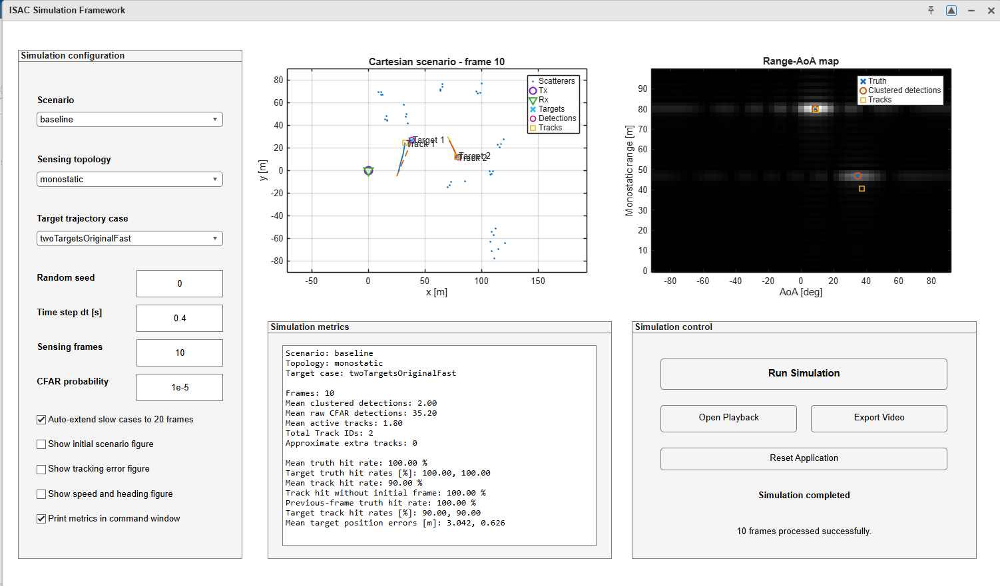
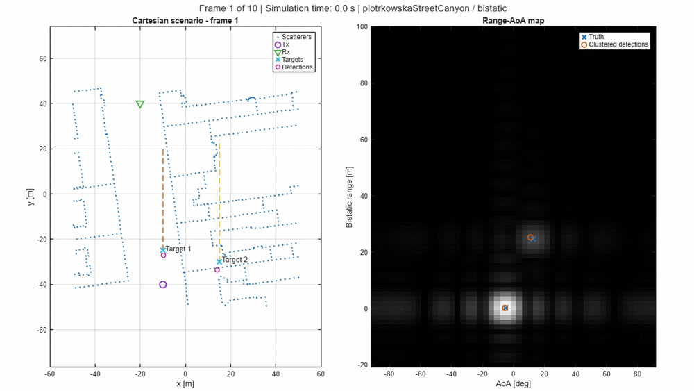
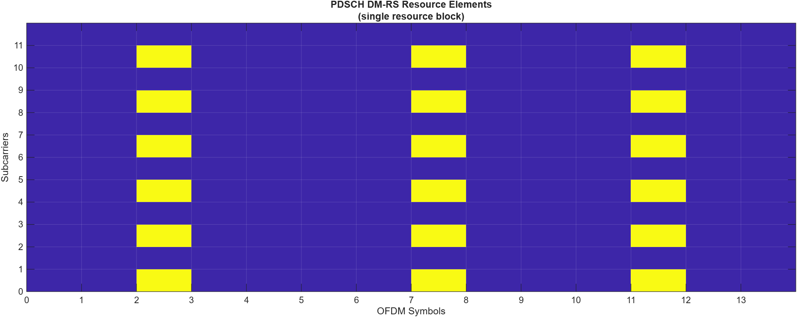
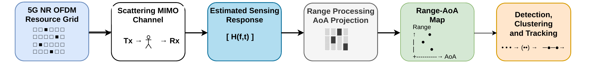
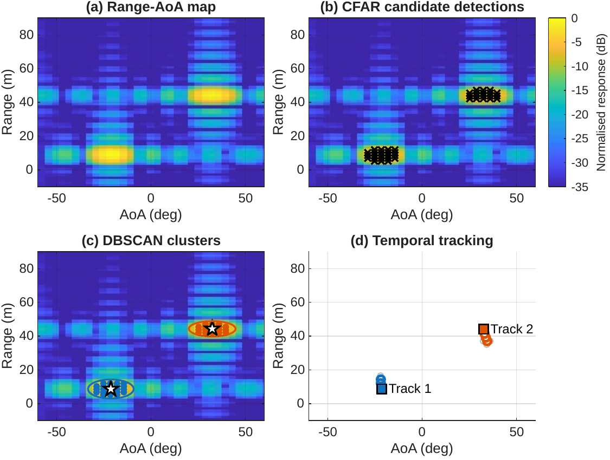
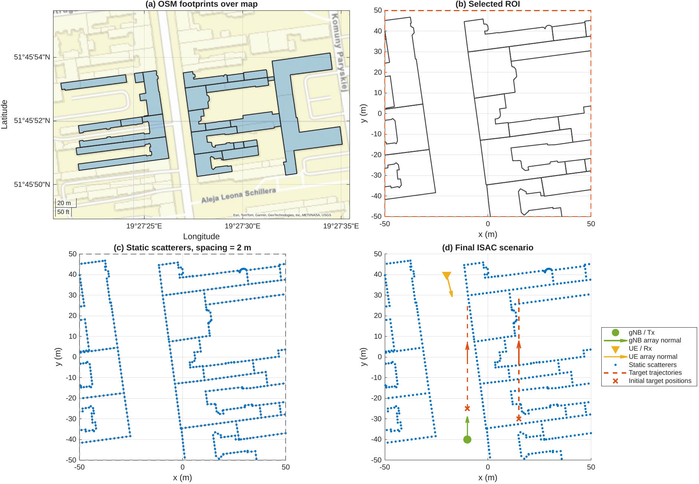
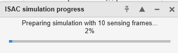
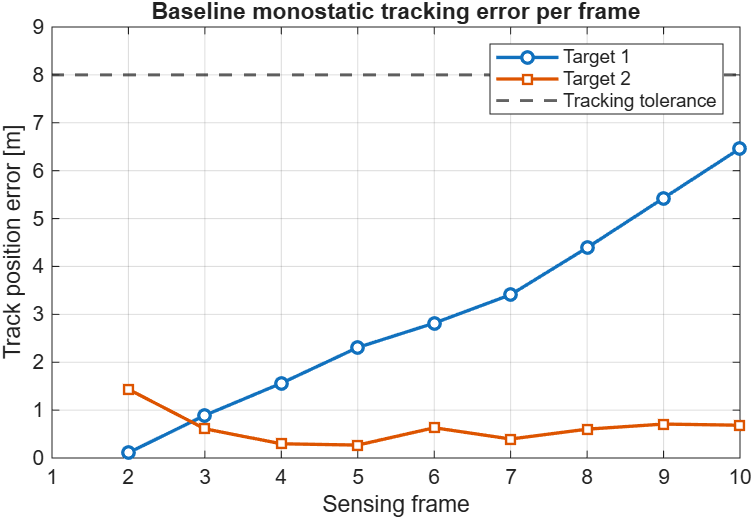
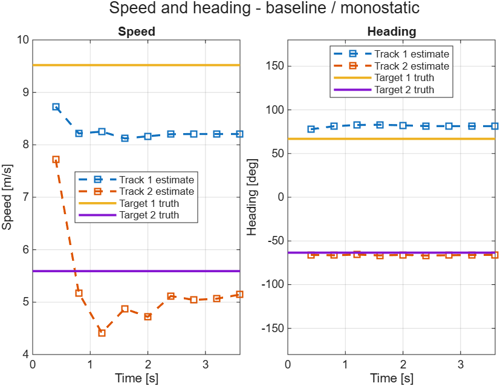
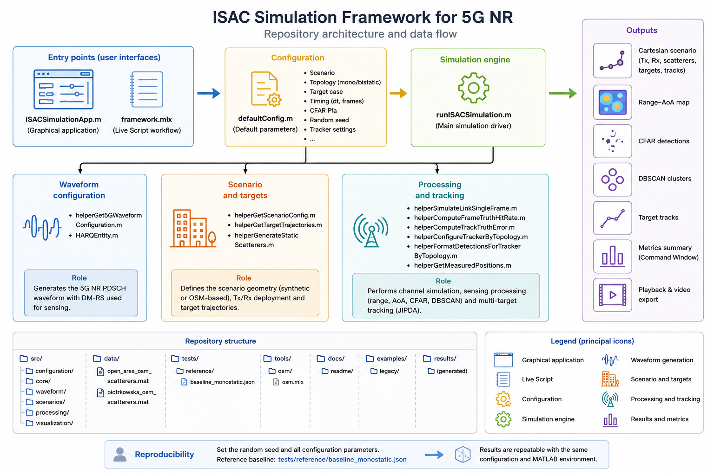

# ISAC Simulation Framework for 5G NR

A modular MATLAB framework for comparing **monostatic and bistatic Integrated Sensing and Communication (ISAC) sensing configurations** using a 5G NR downlink waveform.

<p align="center">
  
</p>

## Overview

Integrated Sensing and Communication (ISAC) extends conventional wireless networks by allowing the same radio signals, spectrum and infrastructure to support both communication and environmental sensing.

This repository provides a configurable MATLAB simulation framework for analysing the sensing side of ISAC systems. It uses a 5G NR downlink waveform as a probing signal and compares monostatic and bistatic sensing configurations under a common processing chain.

The framework simulates passive moving targets and static environmental scatterers, processes the received signal in the Range–Angle of Arrival domain, and applies CFAR detection, DBSCAN clustering and multi-target tracking.

The project includes controlled synthetic scenarios and OpenStreetMap-derived urban environments, together with a graphical application, interactive playback, video export and detection- and tracking-level evaluation metrics.

> **Scope:** this project focuses on sensing performance. It does not evaluate communication throughput, bit error rate, spectral efficiency or a complete communication–sensing trade-off.

## Main features

- 5G NR downlink waveform with PDSCH-associated DM-RS
- Monostatic and bistatic sensing configurations
- Synthetic baseline scenario
- OpenStreetMap-derived urban scenarios
- Configurable single-target and multi-target trajectories
- Static-component suppression
- Range–AoA sensing-map generation
- Two-dimensional CFAR detection
- DBSCAN clustering
- JIPDA-based multi-target tracking
- Detection and tracking metrics
- Per-target and frame-by-frame evaluation
- Interactive simulation playback
- Video export
- Programmatic MATLAB graphical application
- Frame-based simulation progress indicator
- Portable project paths
- Baseline regression reference

## Demo

The following animation shows the frame-by-frame evolution of the **Piotrkowska street-canyon bistatic scenario** using the `twoTargetsOriginalFast` target case.

The left panel displays the OpenStreetMap-derived Cartesian environment, transmitter and receiver deployment, moving targets, clustered detections and active tracks. The right panel shows the corresponding Range–AoA sensing map, ground-truth target references and clustered CFAR observations.

<p align="center">
  
</p>
## Origin and extension of the MathWorks example

This project started from the official MathWorks example [Integrated Sensing and Communication Using 5G Waveform](https://www.mathworks.com/help/phased/ug/integrated-sensing-and-communication-using-5g-waveform.html).

The original example demonstrates a bistatic sensing configuration in which channel matrix estimates obtained from received 5G NR PDSCH frames are processed to extract range and angle information. Its sensing chain includes static-component suppression, Range–AoA processing, CFAR detection, DBSCAN clustering and multi-target tracking.

This repository develops that starting point into a configurable academic simulation framework for comparing ISAC sensing configurations across different geometries, environments and target trajectories.

The main extensions include:

- Support for both monostatic and bistatic sensing configurations
- A common configuration interface for repeatable topology comparisons
- Synthetic and OpenStreetMap-derived environments
- Multiple single-target and multi-target trajectory cases
- Scenario-dependent transmitter and receiver deployment
- Detection-, clustering- and tracking-level evaluation metrics
- Per-target and frame-by-frame performance analysis
- Previous-frame truth comparison for tracker-latency diagnosis
- Interactive playback using stored simulation frames
- Video export without rerunning the propagation simulation
- A graphical MATLAB application with progress reporting
- Modular source-code organisation
- Portable project paths and regression-reference data

> This repository is an independent academic extension and is not an official MathWorks product.
## Requirements

The framework was developed and tested using **MATLAB R2025b**.

The following MathWorks products are required:

| Product | Main use in the framework |
|---|---|
| MATLAB | Core simulation, configuration, visualisation and application interface |
| 5G Toolbox | 5G NR carrier, PDSCH and DM-RS waveform generation |
| Phased Array System Toolbox | Antenna arrays, propagation and sensing processing |
| Radar Toolbox | CFAR detection and radar-oriented processing utilities |
| Sensor Fusion and Tracking Toolbox | Multi-object tracking and track management |
| Signal Processing Toolbox | Signal-processing and numerical utilities |

The required products were identified programmatically using:

```matlab
[files, products] = matlab.codetools.requiredFilesAndProducts( ...
    "ISACSimulationApp.m");

disp(string({products.Name})')
```

Earlier MATLAB releases have not been systematically tested.

## Installation

Clone the repository:

```bash
git clone https://github.com/joseetenreiro/ISAC-Simulation-Framework-5G.git
cd ISAC-Simulation-Framework-5G
```

Alternatively, download the repository as a ZIP file and extract it to a local MATLAB working directory.

The project uses portable paths. From the repository root, run:

```matlab
setupISACProjectPaths();
```

This function automatically adds the required source-code and data directories to the MATLAB path.

## Quick start

### Graphical application

From the repository root, run:

```matlab
ISACSimulationApp
```

The application automatically configures the project paths and provides controls for:

- Scenario selection
- Monostatic or bistatic topology
- Target trajectory selection
- Random seed
- Time step
- Number of sensing frames
- CFAR probability
- Optional diagnostic figures
- Interactive playback
- Video export

### Live Script workflow

Open and run:

```text
framework.mlx
```

The Live Script provides an editable workflow for configuring, executing and analysing a simulation.

### Programmatic workflow

The framework can also be executed directly from MATLAB code:

```matlab
setupISACProjectPaths();

config = defaultConfig();

config.scenarioName = "baseline";
config.topology = "monostatic";
config.targetCase = "twoTargetsOriginalFast";

results = runISACSimulation(config);
```

For a bistatic simulation using the OpenStreetMap-derived Piotrkowska street-canyon scenario:

```matlab
setupISACProjectPaths();

config = defaultConfig();

config.scenarioName = "piotrkowskaStreetCanyon";
config.topology = "bistatic";
config.targetCase = "twoTargetsOriginalFast";

results = runISACSimulation(config);
```

The returned `results` structure contains the stored simulation frames, detections, clustered observations, maintained tracks, ground-truth references and summary metrics.

```bash
git clone https://github.com/joseetenreiro/ISAC-Simulation-Framework-5G.git
cd ISAC-Simulation-Framework-5G
```
## 5G NR probing waveform

The framework uses a 5G NR downlink waveform as the sensing signal. The transmitted waveform includes Physical Downlink Shared Channel (PDSCH) data and its associated Demodulation Reference Signals (DM-RS).

DM-RS symbols are known at the receiver and are conventionally used for radio-channel estimation. In this framework, the estimated channel response is also processed as sensing information because its variation across subcarriers, OFDM symbols and antenna elements contains information related to target delay, angle and motion.

The following figure shows the PDSCH-associated DM-RS resource elements within one resource block:

<p align="center">
  
</p>

The default waveform configuration uses:

| Parameter | Value |
|---|---:|
| Carrier frequency | 30 GHz |
| Nominal channel bandwidth | 50 MHz |
| Occupied transmission bandwidth | 44.64 MHz |
| Subcarrier spacing | 60 kHz |
| Resource blocks | 62 |
| Cyclic prefix | Normal |
| Transmit antennas | 8-element ULA |
| Receive antennas | 8-element ULA |

## Sensing processing chain

The framework applies the same sensing-processing chain to both monostatic and bistatic configurations.

The transmitted 5G NR PDSCH waveform propagates through a scattering MIMO channel containing the transmitter, receiver, static environmental scatterers and passive moving targets. The known DM-RS symbols are used to estimate the frequency-domain channel response, which contains delay- and angle-dependent sensing information.

<p align="center">
  
</p>

The main stages are:

1. **Channel estimation:** the received PDSCH-associated DM-RS symbols are used to estimate the sensing channel response.
2. **Static-component suppression:** stationary contributions are attenuated to emphasise moving-target responses.
3. **Range processing:** frequency-domain channel samples are transformed into candidate propagation delays and ranges.
4. **AoA projection:** the receiver-array response is projected onto a grid of candidate arrival angles.
5. **Range–AoA map formation:** range and angular information are combined into a two-dimensional sensing representation.
6. **Two-dimensional CFAR detection:** statistically significant candidate cells are extracted from the sensing map.
7. **DBSCAN clustering:** neighbouring CFAR cells are grouped into target-level observations.
8. **Multi-target tracking:** clustered observations are associated over consecutive sensing frames using a JIPDA-based tracker.

The following figure illustrates how the raw sensing representation evolves into temporally maintained target tracks:

<p align="center">
  
</p>

The detector operates in the **Range–AoA domain**, rather than through an explicit Range–Doppler map. Target speed and heading are subsequently obtained from the Cartesian velocity state estimated by the tracker and should not be interpreted as direct Doppler measurements.

## Simulation scenarios

The framework includes three scenario families with progressively increasing geometrical complexity.

| Scenario name | Environment source | Region of interest | Main purpose |
|---|---|---:|---|
| `baseline` | Synthetic random scatterers | `[0, 120] × [-80, 80] m` | Controlled validation of the complete sensing and tracking chain |
| `openArea` | OpenStreetMap-derived building contours | `[-120, -20] × [-70, 30] m` | Intermediate comparison using a comparatively open urban environment |
| `piotrkowskaStreetCanyon` | OpenStreetMap-derived building contours | `[-50, 50] × [-50, 50] m` | Main urban street-canyon case study |

### Baseline scenario

The baseline scenario contains randomly generated static scatterers and two configurable moving targets. It provides a controlled environment for validating the complete waveform, sensing, detection, clustering and tracking chain before introducing structured urban geometry.

### Open-area scenario

The open-area scenario is derived from OpenStreetMap building footprints around the Lodz University of Technology campus. It introduces structured static scatterers while maintaining a less constrained geometry than the street-canyon case.

### Piotrkowska street-canyon scenario

The Piotrkowska scenario represents a section of Piotrkowska Street in Lodz. Building contours create a constrained street-like environment in which target visibility, clutter and tracking performance depend strongly on the selected transmitter–receiver geometry.

The following figure summarises the construction of the Piotrkowska scenario:

<p align="center">
  
</p>

The construction process consists of four main stages:

1. Import building footprints from an OpenStreetMap-derived GeoJSON file.
2. Convert latitude and longitude coordinates into a local Cartesian coordinate system expressed in metres.
3. Select a scenario-specific region of interest and sample the building boundaries.
4. Use the sampled boundary points as static scatterers and add the transmitter, receiver and target trajectories.

> The OSM buildings are represented as sampled point scatterers along their contours. They are not modelled as complete three-dimensional electromagnetic surfaces.
## Graphical application

The repository includes a programmatic MATLAB graphical application that provides a single interface for configuring, executing and reviewing ISAC simulations.

Launch the application from the repository root:

```matlab
ISACSimulationApp
```

The application automatically configures the project paths and exposes the main simulation parameters without requiring changes to the source code.

### Simulation configuration

The application allows the user to select:

- Scenario
- Monostatic or bistatic sensing topology
- Target trajectory case
- Random seed
- Time step between sensing frames
- Number of sensing frames
- CFAR false-alarm probability
- Automatic extension of slow-target cases to 20 frames

Optional diagnostic outputs can also be enabled:

- Initial scenario geometry
- Tracking position error per frame
- Target and track speed and heading comparison
- Metrics summary in the MATLAB Command Window

### Frame-based progress reporting

During execution, the simulation reports its progress while the sensing frames are prepared and processed. The progress window displays the current operation and the corresponding completion percentage.

<p align="center">
  
</p>

This progress indicator is especially useful for OpenStreetMap-derived scenarios, which contain a larger number of static scatterers, and for slow-target cases that automatically use 20 sensing frames.

### Results displayed in the application

After the simulation finishes, the application presents:

- Final Cartesian sensing scenario
- Transmitter and receiver positions
- Static environmental scatterers
- Ground-truth target positions
- Clustered detections
- Maintained target tracks
- Final Range–AoA sensing map
- Detection and tracking summary metrics

### Interactive playback

The application stores the information generated at every sensing frame. The **Open Playback** control opens an interactive viewer that allows the user to:

- Play and pause the simulation
- Move through the stored frames
- Inspect the Cartesian scenario
- Inspect the corresponding Range–AoA map
- Review the temporal evolution without rerunning the propagation simulation

### Video export

The **Export Video** control renders the stored simulation frames into a Motion JPEG AVI file.

Because the export process uses previously stored frames, the waveform generation, propagation and sensing-processing stages are not executed again.

A typical exported file is named according to its scenario and topology:

```text
piotrkowskaStreetCanyon-bistatic-playback.avi
```
## Outputs and evaluation metrics

The framework evaluates the sensing chain at detection, clustering and tracking levels. This distinction is important because a raw CFAR cell, a clustered observation and a maintained target track represent different stages of the processing chain.

### Detection and clustering metrics

| Metric | Description |
|---|---|
| Mean raw CFAR detections | Average number of CFAR-positive Range–AoA cells per sensing frame |
| Mean clustered detections | Average number of target-level observations after DBSCAN clustering |
| Mean truth hit rate | Fraction of target-frame pairs associated with a valid clustered detection |
| Target truth hit rate | Detection hit rate calculated independently for each target |

The truth hit rate evaluates whether the sensing and clustering stages produce an observation sufficiently close to the target ground truth. It does not require the tracker to have confirmed or maintained a track.

### Tracking metrics

| Metric | Description |
|---|---|
| Mean active tracks | Average number of maintained tracks per sensing frame |
| Total Track IDs | Number of unique track identifiers created during the simulation |
| Approximate extra tracks | Track identifiers exceeding the expected number of physical targets |
| Mean track hit rate | Fraction of target-frame pairs matched with a maintained track |
| Track hit rate without initial frame | Track hit rate after excluding the first sensing frame |
| Previous-frame truth hit rate | Track hit rate evaluated against the previous target position |
| Target track hit rate | Tracking hit rate calculated independently for each target |
| Mean target position error | Mean Cartesian distance between matched tracks and targets |

The metric excluding the initial frame helps separate tracker-initialisation behaviour from steady-state tracking performance.

The previous-frame truth comparison is included as a diagnostic metric for identifying approximately one-frame tracking latency. It should not replace the conventional current-frame tracking evaluation.

### Representative validated baseline

The default regression reference corresponds to:

```text
Scenario:    baseline
Topology:    monostatic
Target case: twoTargetsOriginalFast
Random seed: 0
Frames:      10
```

The stored baseline reference contains the following representative values:

| Metric | Result |
|---|---:|
| Mean truth hit rate | 100% |
| Target truth hit rates | 100%, 100% |
| Mean track hit rate | 90% |
| Track hit rate without initial frame | 100% |
| Previous-frame truth hit rate | 100% |
| Mean clustered detections per frame | 2.00 |
| Mean raw CFAR detections per frame | 35.20 |
| Mean active tracks per frame | 1.80 |
| Total Track IDs | 2 |
| Approximate extra tracks | 0 |
| Mean Target 1 position error | 3.04 m |
| Mean Target 2 position error | 0.63 m |

These values are used as a regression reference rather than as a universal performance claim. Results depend on the selected topology, geometry, target trajectory, random seed and processing configuration.

<details>
<summary><strong>Representative tracking figures</strong></summary>

### Track position error

The following figure shows the Cartesian position error for each target across the sensing frames. The dashed horizontal line represents the configured track-to-target distance tolerance.

<p align="center">
  
</p>

### Speed and heading estimates

The next figure compares the velocity-state estimates produced by the tracker with the corresponding target ground truth.

<p align="center">
  
</p>

The displayed speed and heading values are derived from the Cartesian velocity state of the tracker. They are not direct Doppler measurements.

</details>
## Repository structure

The repository separates user entry points, configuration, simulation logic, processing modules, visualisation utilities, data and validation resources.

<p align="center">
  
</p>


```text
ISAC-Simulation-Framework-5G/
├── ISACSimulationApp.m
├── framework.mlx
├── setupISACProjectPaths.m
├── README.md
│
├── src/
│   ├── configuration/
│   │   └── defaultConfig.m
│   │
│   ├── core/
│   │   └── runISACSimulation.m
│   │
│   ├── waveform/
│   │   ├── helperGet5GWaveformConfiguration.m
│   │   └── HARQEntity.m
│   │
│   ├── scenarios/
│   │   ├── helperGetScenarioConfig.m
│   │   ├── helperGetTargetTrajectories.m
│   │   └── helperGenerateStaticScatterers.m
│   │
│   ├── processing/
│   │   ├── helperSimulateLinkSingleFrame.m
│   │   ├── helperComputeFrameTruthHitRate.m
│   │   ├── helperComputeTrackTruthError.m
│   │   ├── helperConfigureTrackerByTopology.m
│   │   ├── helperFormatDetectionsForTrackerByTopology.m
│   │   └── helperGetMeasuredPositions.m
│   │
│   └── visualization/
│       ├── renderISACFrame.m
│       ├── playISACResults.m
│       ├── exportISACVideo.m
│       ├── helperCFARResultsVisualizer.m
│       ├── helperTheaterPlotter.m
│       ├── helperVisualizeResourceGrid.m
│       ├── helperVisualizeScatteringMIMOChannel.m
│       ├── helperPlotTrackPositionErrorPerFrame.m
│       └── helperPlotSpeedEstimationResults.m
│
├── data/
│   ├── open_area_osm_scatterers.mat
│   └── piotrkowska_osm_scatterers.mat
│
├── tests/
│   └── reference/
│       └── baseline_monostatic.json
│
├── tools/
│   └── osm/
│       └── osm.mlx
│
├── docs/
│   └── readme/
│
├── examples/
│   └── legacy/
│
└── results/
```

### Main entry points

| File | Purpose |
|---|---|
| `ISACSimulationApp.m` | Launches the graphical application |
| `framework.mlx` | Provides an editable Live Script workflow |
| `setupISACProjectPaths.m` | Configures portable project paths |
| `defaultConfig.m` | Defines the default simulation parameters |
| `runISACSimulation.m` | Executes the complete configurable simulation |

### Modular execution flow

The main execution flow is:

```text
Graphical application or Live Script
                ↓
          defaultConfig
                ↓
       runISACSimulation
                ↓
 ┌──────────────┼──────────────┐
 ↓              ↓              ↓
Waveform      Scenario      Processing
configuration geometry      and tracking
 └──────────────┼──────────────┘
                ↓
         Results structure
                ↓
 Metrics, figures, playback and video export
```

The simulation engine is independent of the graphical application. This allows the same processing chain to be executed through the application, the Live Script or a MATLAB program.

## Reproducibility and regression reference

The framework uses an explicit random seed to make the stochastic components of a simulation repeatable:

```matlab
config = defaultConfig();
config.randomSeed = 0;
```

The selected scenario, topology, target case, timing parameters and CFAR configuration are stored inside the returned `results.config` structure.

A reproducible baseline simulation can be executed with:

```matlab
setupISACProjectPaths();

config = defaultConfig();

config.scenarioName = "baseline";
config.topology = "monostatic";
config.targetCase = "twoTargetsOriginalFast";
config.randomSeed = 0;
config.dt = 0.4;
config.numSensingFrames = 10;
config.cfarPfa = 1e-5;

results = runISACSimulation(config);
```

The reference output for this configuration is stored in:

```text
tests/reference/baseline_monostatic.json
```

The reference file records detection, tracking and position-error metrics, including a mean truth hit rate of `1.0`, a mean track hit rate of `0.9`, two unique track identifiers and zero additional tracks. 

The regression reference is intended to detect unintended changes in the validated baseline behaviour. It is not a performance requirement for every scenario or configuration.

### Factors affecting reproducibility

Results can change when modifying:

- Random seed
- Scenario geometry
- Sensing topology
- Target trajectory
- Number of sensing frames
- CFAR probability
- Tracker parameters
- MATLAB or toolbox version

For comparable experiments, all relevant configuration values should be reported together with the resulting metrics.
## Academic background

This repository originates from the Bachelor's Thesis:

> **Development of a Simulation Framework for Comparison of Integrated Sensing and Communication System Topologies**

The work was developed by **José Carlos Tenreiro Arias** in 2026 during an academic mobility period at **Łódź University of Technology, Poland**, as part of the **Grado en Ingeniería de Tecnologías y Servicios de Telecomunicación** at **ETSIT — Universidad Politécnica de Madrid**.

The thesis focused on the design and validation of a configurable MATLAB framework for comparing monostatic and bistatic ISAC sensing configurations using a 5G NR downlink waveform.

The graphical application, portable project structure, stored-frame playback, video export, progress reporting and regression-oriented repository organisation extend the original thesis implementation into a more accessible and reusable software project.

### Academic institutions

- **Łódź University of Technology**, Poland — mobility institution and destination university where the thesis was developed and defended
- **ETSIT — Universidad Politécnica de Madrid**, Spain — home institution

## Acknowledgements

This project builds upon the official MathWorks example:

- [Integrated Sensing and Communication Using 5G Waveform](https://www.mathworks.com/help/phased/ug/integrated-sensing-and-communication-using-5g-waveform.html)

The original example provided the starting point for the 5G NR bistatic sensing chain, including PDSCH-associated DM-RS processing, scattering-channel simulation, Range–AoA processing, CFAR detection, DBSCAN clustering and multi-target tracking.

The present repository is an independent academic extension and is not an official MathWorks product.

The author also acknowledges:

- **Łódź University of Technology**, Poland, for hosting the academic mobility period during which the thesis was developed and defended
- **ETSIT — Universidad Politécnica de Madrid**, Spain, as the home academic institution
- **Dr inż. Piotr Korbel** for academic supervision at Łódź University of Technology
- **José Manuel Riera Salís** for academic supervision at ETSIT-UPM
- **OpenStreetMap contributors** for the geographical building data used to construct the urban scenarios
- **MathWorks** for the MATLAB products, documentation and examples used during development

MATLAB and the referenced MathWorks toolboxes are products of The MathWorks, Inc.
## Author

**José Carlos Tenreiro Arias**

Grado en Ingeniería de Tecnologías y Servicios de Telecomunicación  
Itinerario en Sistemas de Telecomunicación  

**Home institution:**  
ETSIT — Universidad Politécnica de Madrid, Spain

**Mobility institution:**  
Łódź University of Technology, Poland

- GitHub: [@joseetenreiro](https://github.com/joseetenreiro)
- LinkedIn: [José Carlos Tenreiro Arias](https://www.linkedin.com/in/jose-carlos-tenreiro)
## License status

A dedicated repository licence has not yet been added.

Some source files are based on or adapted from the referenced MathWorks example and retain their corresponding copyright notices. The licensing terms for the original and newly developed components should be reviewed before adding an open-source licence to the complete repository.